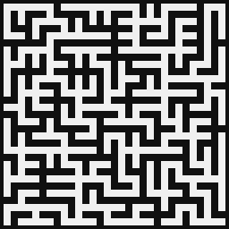
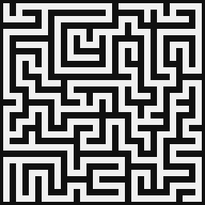
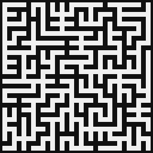

# Maze Generator

Implemented methods:
* **Prim's algorithm** - biased towards short dead ends

	

* **Depth-first search** - biased towards long paths with few branches

	

* **Wilson's algorithm** - unbiased (generates all possible mazes with equal probability)

	
